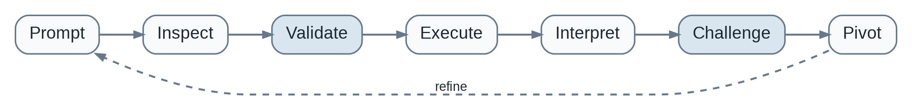
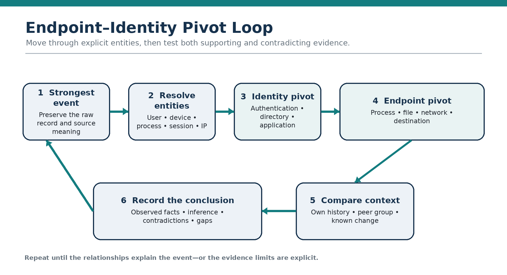
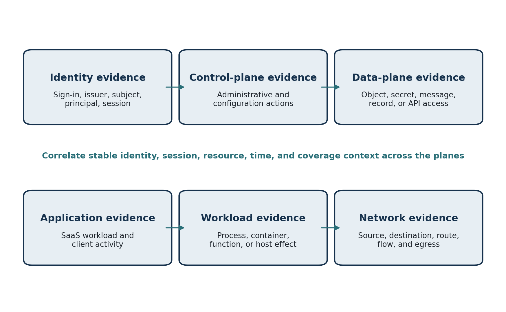

# Practical Threat Hunting

Official companion repository for the **Practical Threat Hunting** book series by **Grant Halden**.

The series combines durable threat-hunting methodology with an updateable implementation layer for endpoint, identity, cloud, Microsoft 365, and AI-system investigations. The books explain how to reason through a hunt; this repository carries query examples, source notes, figures, errata, and platform-specific material that can change between print revisions.

- Author website: https://grant-halden.author-pages.com
- Author contact: granthalden.author@gmail.com

## Books in the Series

### Book 1 — Modern Techniques for the AI-Augmented SOC

**Practical Threat Hunting: Modern Techniques for the AI-Augmented SOC** 
*25 Hands-On Hunts Across Endpoint, Identity, Cloud, Microsoft 365, and AI Systems*

Status: **Published — First Edition, August 2026**

- [Kindle edition](https://www.amazon.com/dp/B0HFGYN38J) — ASIN `B0HFGYN38J`
- [Paperback edition](https://www.amazon.com/dp/B0HFHD55GB) — ASIN `B0HFHD55GB`
- Paperback ISBN: `9798192696538`
- [Book 1 hunt implementations](hunts/README.md#book-1--modern-techniques-for-the-ai-augmented-soc)
- [Book 1 figures](assets/figures/README.md#book-1--modern-techniques-for-the-ai-augmented-soc)
- [Book 1 Amazon A+ content assets](assets/a-plus/book-01-modern-techniques/README.md)

### Book 2 — Endpoint and Identity Threats

**Practical Threat Hunting: Endpoint and Identity Threats** 
*24 Hands-On Hunts for the AI-Augmented SOC*

Status: **Scheduled for publication September 3, 2026 — Kindle pre-order live**

- [Kindle edition](https://www.amazon.com/dp/B0HFLS6MVC) — ASIN `B0HFLS6MVC`
- Paperback — release scheduled September 3, 2026 — ASIN `B0HFNDYLTJ`
- Paperback ISBN: `9798193349570`
- [Book 2 hunt implementations](hunts/book-02-endpoint-and-identity/README.md)
- [Book 2 figures](assets/figures/README.md#book-2--endpoint-and-identity-threats)
- [Book 2 Amazon A+ content assets](assets/a-plus/book-02-endpoint-identity/README.md)
- [Book 2 edition information](book/endpoint-and-identity-threats.md)

### Book 3 — Cloud and SaaS Environments

**Practical Threat Hunting: Cloud and SaaS Environments** 
*24 Hands-On Hunts Across AWS, Azure, Microsoft 365, Google Workspace, and GitHub*

Status: **First edition complete — Amazon identifiers pending**

- Paperback ISBN: `9798193986522`
- Kindle ASIN: pending
- Paperback ASIN: pending
- [Book 3 hunt index and reference queries](hunts/book-03-cloud-and-saas/README.md)
- [Book 3 figures](assets/figures/README.md#book-3--cloud-and-saas-environments)
- [Book 3 Amazon A+ content package](assets/a-plus/book-03-cloud-saas/README.md)
- [Book 3 edition information](book/cloud-and-saas-environments.md)

## Representative Visuals

### Book 1: AI Validation Loop

### Book 2: Endpoint–Identity Pivot Loop

### Book 3: Cloud and SaaS Evidence-Plane Map

See the [complete figure gallery](assets/figures/README.md) for supporting visuals from all three books.

## What You'll Find Here

- Companion implementations for 25 Book 1 hunts, 24 Book 2 hunts, and 24 Book 3 hunts
- Microsoft Defender XDR and Microsoft Sentinel KQL examples
- Selected Athena SQL, Splunk SPL, CrowdStrike LogScale, PowerShell, Google Workspace Reports API pseudocode, Windows-event, Okta, and provider-neutral examples
- Evidence-bound AI analysis prompts and verification guidance
- Detection opportunities, telemetry requirements, and investigation pivots
- MITRE ATT&CK, MITRE ATLAS, OWASP, NIST, and first-party product references
- Book figures, edition notes, errata, and corrections

## Repository Structure

- [`hunts/`](hunts/) — book-specific hunt implementations and query files.
- [`resources/`](resources/) — AI-validation, framework, query, source, and hunt-library references.
- [`book/`](book/) — series edition information and errata.
- [`assets/figures/`](assets/figures/) — supporting figures organized by book.
- [`assets/a-plus/`](assets/a-plus/) — upload-ready Amazon A+ images and module copy organized by book.

## Book vs. Repository

The **books are the durable teaching layer**: methodology, reasoning, interpretation, investigation pivots, and analyst judgment.

The **repository is the updateable implementation layer**: query syntax, field names, current schemas, source links, corrections, validation notes, and platform-specific variants.

Queries and examples must be reviewed and adapted to the target organization's telemetry, schemas, licensing, authorization boundaries, and security controls before use. See [DISCLAIMER.md](DISCLAIMER.md).

## Corrections and Feedback

If you identify an outdated field, broken query, book correction, or technical issue, open the appropriate GitHub Issue. External pull requests are not currently accepted.
