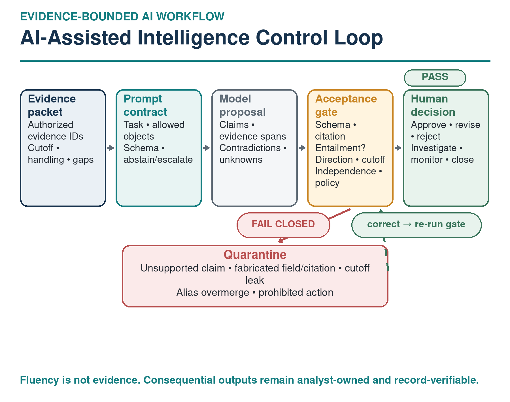
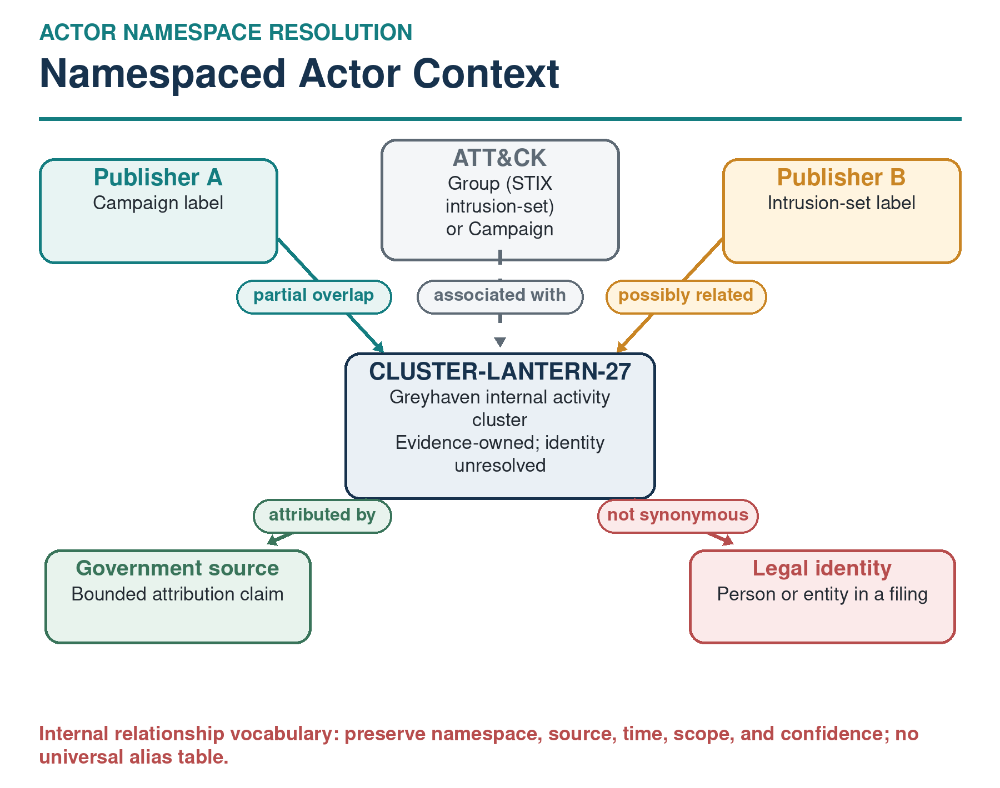
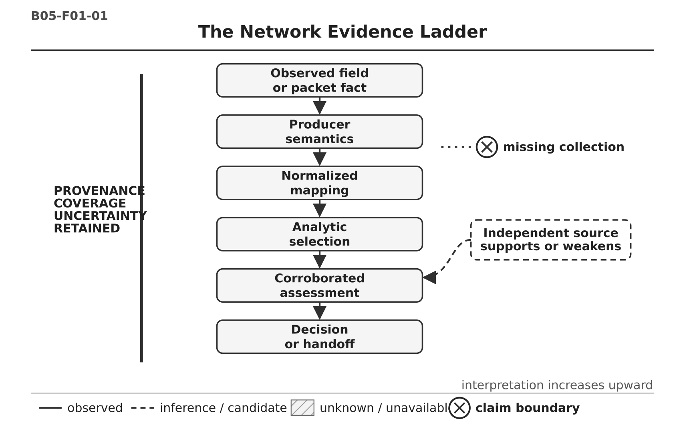
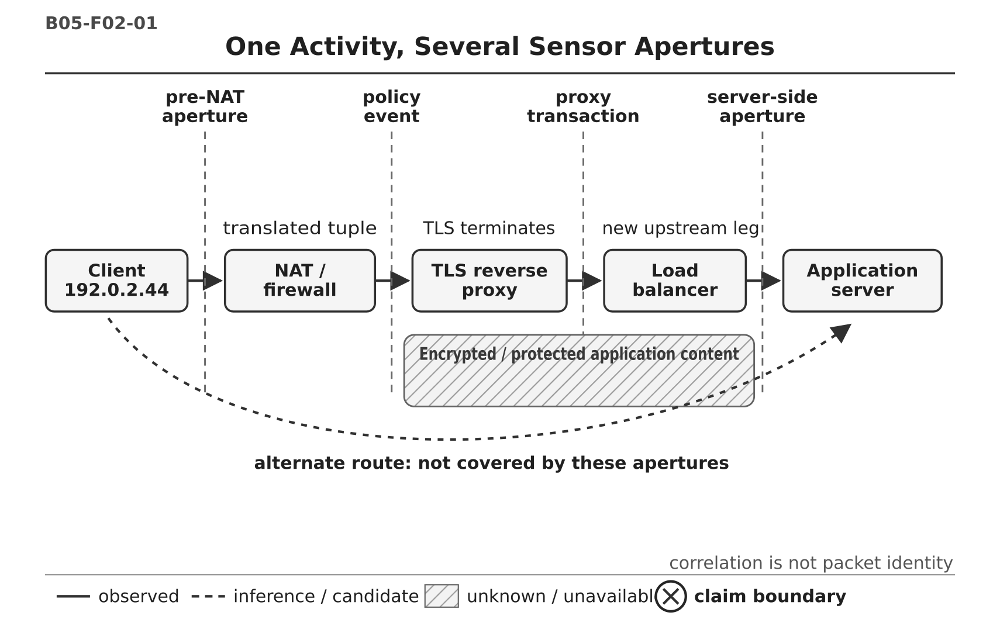
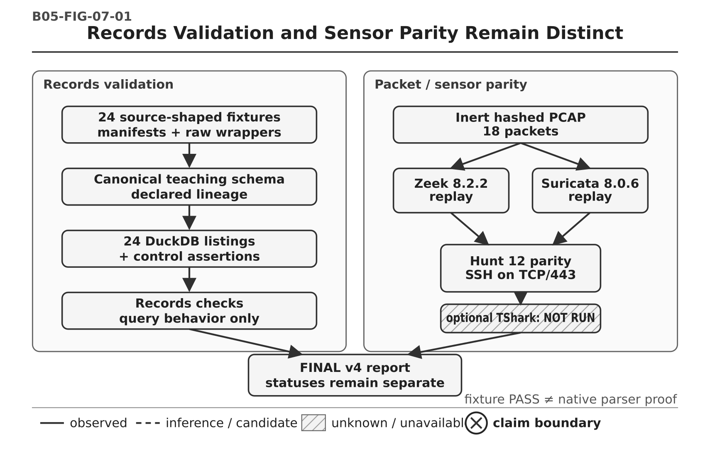

# Book Figure Gallery

Supporting diagrams from the **Practical Threat Hunting** series. The manuscript source is not stored in this repository.

## Book 1 — Modern Techniques for the AI-Augmented SOC

### AI Validation Loop

Book 1 figure files:

- [`fig_1_1_hunt_lifecycle.png`](fig_1_1_hunt_lifecycle.png) — threat-hunt lifecycle.
- [`fig_1_2_disciplines.png`](fig_1_2_disciplines.png) — related defensive disciplines.
- [`fig_2_1_telemetry_map.png`](fig_2_1_telemetry_map.png) — telemetry relationship map.
- [`fig_3_1_ai_validation_loop.png`](fig_3_1_ai_validation_loop.png) — AI validation loop.
- [`fig_5_1_framework_stack.png`](fig_5_1_framework_stack.png) — framework stack.
- [`fig_part5_cross_domain.png`](fig_part5_cross_domain.png) — cross-domain hunting relationships.
- [`fig_20_1_campaign_workflow.png`](fig_20_1_campaign_workflow.png) — campaign-hunting workflow.
- [`fig_21_1_shadow_ai_visibility.png`](fig_21_1_shadow_ai_visibility.png) — shadow-AI visibility model.
- [`fig_23_1_machine_identity_baseline.png`](fig_23_1_machine_identity_baseline.png) — machine-identity baseline.
- [`fig_24_1_agent_action_boundary.png`](fig_24_1_agent_action_boundary.png) — AI-agent action boundary.
- [`fig_31_1_hunt_to_detection.png`](fig_31_1_hunt_to_detection.png) — hunt-to-detection transition.
- [`fig_32_1_hunt_library_record.png`](fig_32_1_hunt_library_record.png) — minimum hunt-library record.
- [`fig_34_1_ai_augmented_lifecycle.png`](fig_34_1_ai_augmented_lifecycle.png) — AI-augmented hunt lifecycle.

## Book 2 — Endpoint and Identity Threats

### Endpoint–Identity Pivot Loop

### Evidence-Preserving AI Workflow

### Session-Replay Evidence Chain

### Hunt-to-Detection Promotion Ladder

### Cross-Domain Entity Map

Book 2 figures are author-created analytical models. They support the investigation workflows described in the book and are not product architecture diagrams.

## Book 3 — Cloud and SaaS Environments

### Cloud and SaaS Evidence-Plane Map

### Human, Application, and Workload Identity Graph

### Temporary Credential Provenance Chain

### Cloud Administration Command Evidence Chain

### SaaS API Activity Investigation Chain

### Cross-Cloud Capstone Evidence Graph

Book 3 figures are author-created analytical models. They describe evidence relationships and investigation workflows, not provider architecture or guaranteed telemetry coverage.

## Book 4 — Threat Intelligence and Adversary Infrastructure

### Time-Bound Infrastructure Graph

### Evidence-Bounded AI Control Loop

### Actor Namespace Graph

Book 4 figure files:

- [`vertical_intelligence_priority_model.png`](book-04/vertical_intelligence_priority_model.png) — organization-specific vertical intelligence priority model.
- [`intelligence_to_hunt_chain.png`](book-04/intelligence_to_hunt_chain.png) — seven-stage intelligence-to-hunt workflow with a controlled feedback loop.
- [`attack_procedure_to_collection_workflow.png`](book-04/attack_procedure_to_collection_workflow.png) — ATT&CK procedure-to-collection translation workflow.
- [`actor_research_source_classes.png`](book-04/actor_research_source_classes.png) — six source classes kept separate from authority or confidence scoring.
- [`claim_level_source_independence.png`](book-04/claim_level_source_independence.png) — claim-level source and dependency analysis.
- [`time_bound_infrastructure_graph.png`](book-04/time_bound_infrastructure_graph.png) — typed, time-bounded adversary-infrastructure graph.
- [`intelligence_state_axes.png`](book-04/intelligence_state_axes.png) — independent evidence, claim, use, action, workflow, and confidence states.
- [`evidence_bounded_ai_control_loop.png`](book-04/evidence_bounded_ai_control_loop.png) — evidence-bounded AI acceptance and quarantine gates.
- [`lookalike_domain_pivot_workflow.png`](book-04/lookalike_domain_pivot_workflow.png) — explainable lookalike-domain pivot workflow.
- [`phishing_evidence_layers.png`](book-04/phishing_evidence_layers.png) — message, authentication, navigation, page, payload, and enterprise evidence layers.
- [`sample_to_infrastructure_expansion.png`](book-04/sample_to_infrastructure_expansion.png) — malware sample-to-infrastructure expansion with promotion stops.
- [`multi_tenant_service_context.png`](book-04/multi_tenant_service_context.png) — provider, tenant, account, object, and path separation for legitimate-service abuse.
- [`temporal_campaign_windows.png`](book-04/temporal_campaign_windows.png) — synthetic UTC observation timeline with explicit collection gaps and assessment cutoffs.
- [`actor_namespace_graph.png`](book-04/actor_namespace_graph.png) — namespaced actor, campaign, legal, and publisher claims.
- [`competing_hypotheses_matrix.png`](book-04/competing_hypotheses_matrix.png) — qualitative comparison of campaign, shared-resource, and coincidence hypotheses.
- [`report_to_collection_workflow.png`](book-04/report_to_collection_workflow.png) — source report to reproducible collection-plan workflow.
- [`retrospective_hunt_package.png`](book-04/retrospective_hunt_package.png) — versioned retrospective-hunt package and reproducibility manifest.
- [`context_preserving_interoperability.png`](book-04/context_preserving_interoperability.png) — canonical evidence contract with STIX, TAXII, MISP, and OpenCTI adapters.
- [`technical_accuracy_maintenance_loop.png`](book-04/technical_accuracy_maintenance_loop.png) — change-triggered technical accuracy and correction loop.

Book 4 figures are author-created analytical models. They describe evidence relationships, source controls, analysis workflows, and interoperability boundaries. They are not provider architecture diagrams, claims of guaranteed telemetry coverage, or actor-attribution conclusions.

## Book 5 — Network Traffic and Command-and-Control

### Network Evidence Ladder

### Sensor Apertures

### Records and Sensor Validation

Book 5 figure files:

- [`B05-F01-01.png`](book-05/B05-F01-01.png) — the network evidence ladder.
- [`B05-F02-01.png`](book-05/B05-F02-01.png) — one activity across several sensor apertures.
- [`B05-F03-01.png`](book-05/B05-F03-01.png) — the middlebox identity-and-time braid.
- [`B05-FIG-04-01.png`](book-05/B05-FIG-04-01.png) — protocol classification as a bounded join.
- [`B05-FIG-05-01.png`](book-05/B05-FIG-05-01.png) — canonical fields retaining source meaning.
- [`B05-FIG-06-01.png`](book-05/B05-FIG-06-01.png) — collection coverage changing the denominator.
- [`B05-FIG-07-01.png`](book-05/B05-FIG-07-01.png) — records validation and sensor parity as distinct evidence layers.
- [`B05-F13-01.png`](book-05/B05-F13-01.png) — censor, compare, then select for long-lived flows.
- [`B05-F14-01.png`](book-05/B05-F14-01.png) — type-aware ICMP echo symmetry.
- [`B05-F15-01.png`](book-05/B05-F15-01.png) — outer protocol at three observation points.
- [`B05-F16-01.png`](book-05/B05-F16-01.png) — the maximum defensible passive SSH conclusion.
- [`B05-H17-F01.png`](book-05/B05-H17-F01.png) — three-channel evidence braid.
- [`B05-H18-F01.png`](book-05/B05-H18-F01.png) — role-aware fan-out graph.
- [`B05-H19-F01.png`](book-05/B05-H19-F01.png) — evidence layers across six peers.
- [`B05-H20-F01.png`](book-05/B05-H20-F01.png) — expected administrative path versus peer bypass.
- [`B05-H21-F01.png`](book-05/B05-H21-F01.png) — VPN interval mapping before fan-out analysis.
- [`B05-H22-F01.png`](book-05/B05-H22-F01.png) — file visibility as an analytic gate.
- [`B05-H23-F01.png`](book-05/B05-H23-F01.png) — flow-counter normalization before bulk scoring.
- [`B05-H24-F01.png`](book-05/B05-H24-F01.png) — bulk and accumulation across different horizons.
- [`B05-F32-01.png`](book-05/B05-F32-01.png) — relative evidence timeline with uncertainty.
- [`B05-F32-02.png`](book-05/B05-F32-02.png) — compound investigation graph.
- [`B05-F33-01.png`](book-05/B05-F33-01.png) — bounded handoff loop.

Book 5 figures are original analytical models. Color is not the only carrier of meaning: line style, enclosure, labels, hatching, and boundary markers preserve interpretation. The figures do not claim guaranteed visibility, attribution, or maliciousness.
