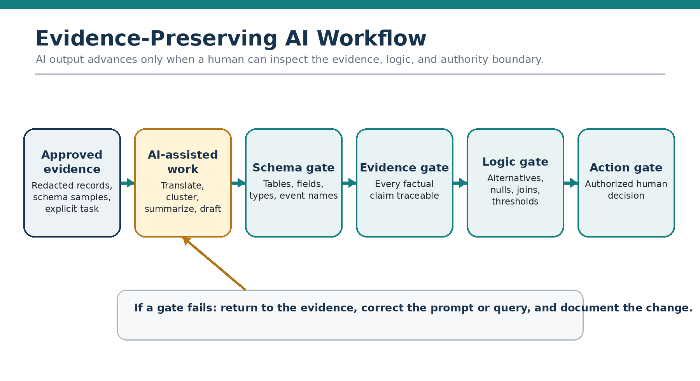
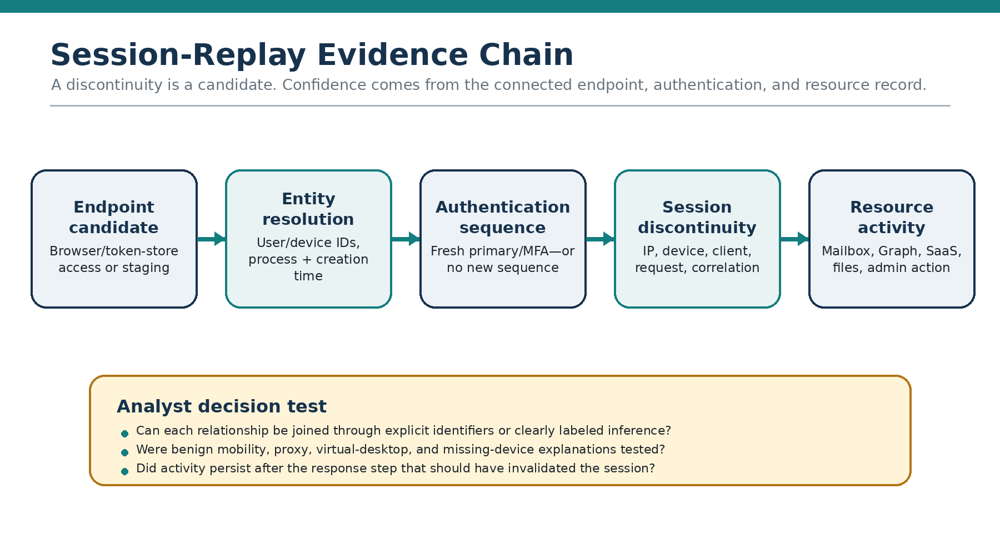
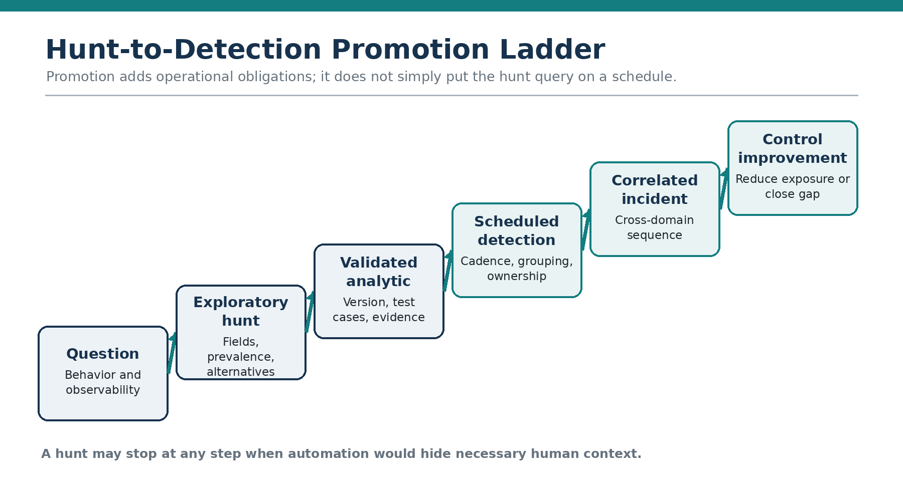
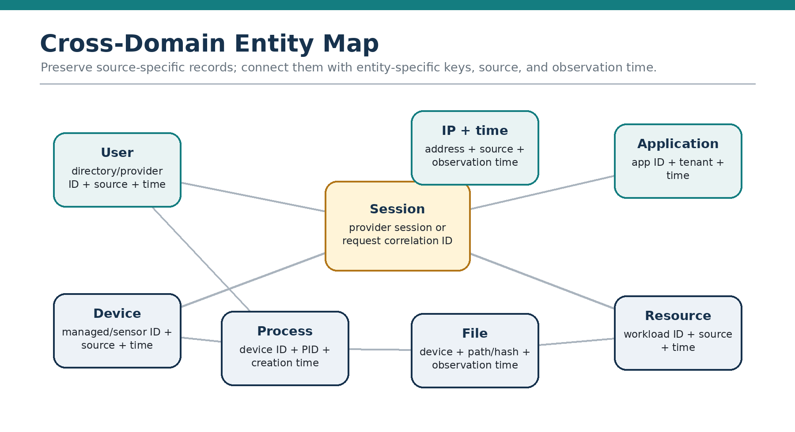
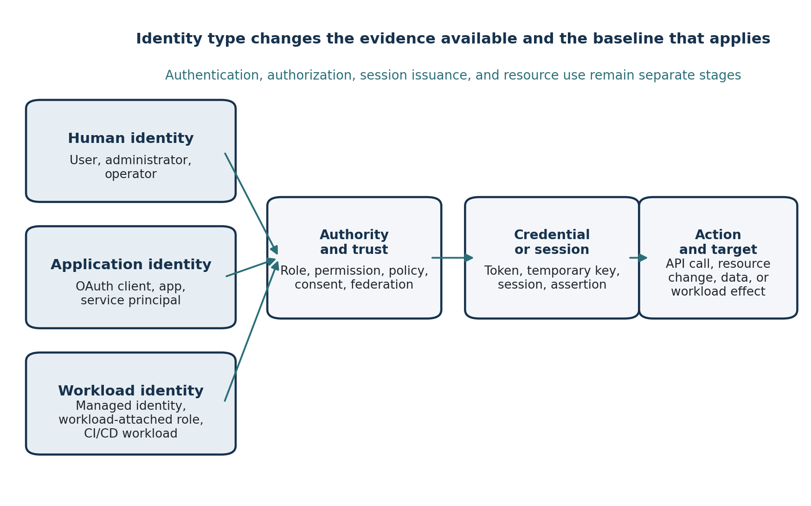
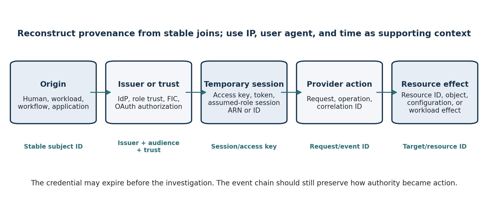
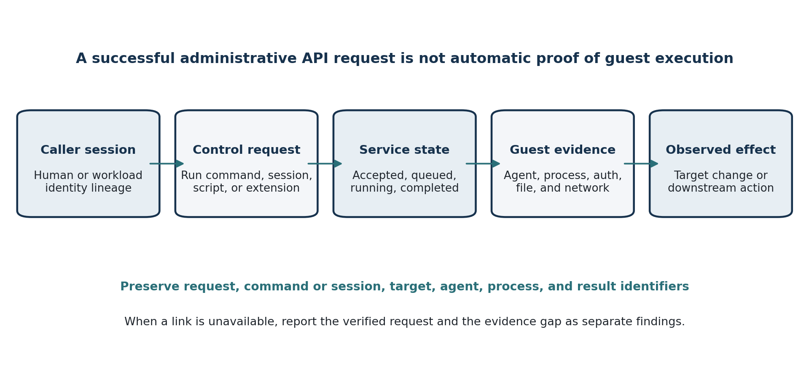
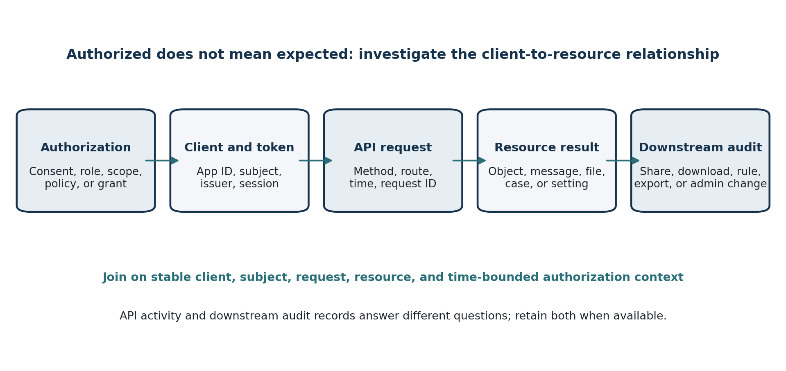
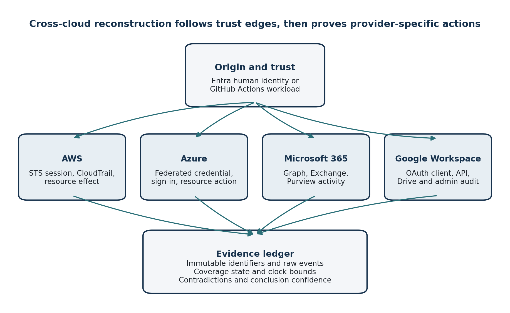

# Book Figure Gallery

Supporting diagrams from the **Practical Threat Hunting** series. The manuscript source is not stored in this repository.

## Book 1 — Modern Techniques for the AI-Augmented SOC

### AI Validation Loop

Book 1 figure files:

- [`fig_1_1_hunt_lifecycle.png`](fig_1_1_hunt_lifecycle.png) — threat-hunt lifecycle.
- [`fig_1_2_disciplines.png`](fig_1_2_disciplines.png) — related defensive disciplines.
- [`fig_2_1_telemetry_map.png`](fig_2_1_telemetry_map.png) — telemetry relationship map.
- [`fig_3_1_ai_validation_loop.png`](fig_3_1_ai_validation_loop.png) — AI validation loop.
- [`fig_5_1_framework_stack.png`](fig_5_1_framework_stack.png) — framework stack.
- [`fig_part5_cross_domain.png`](fig_part5_cross_domain.png) — cross-domain hunting relationships.
- [`fig_20_1_campaign_workflow.png`](fig_20_1_campaign_workflow.png) — campaign-hunting workflow.
- [`fig_21_1_shadow_ai_visibility.png`](fig_21_1_shadow_ai_visibility.png) — shadow-AI visibility model.
- [`fig_23_1_machine_identity_baseline.png`](fig_23_1_machine_identity_baseline.png) — machine-identity baseline.
- [`fig_24_1_agent_action_boundary.png`](fig_24_1_agent_action_boundary.png) — AI-agent action boundary.
- [`fig_31_1_hunt_to_detection.png`](fig_31_1_hunt_to_detection.png) — hunt-to-detection transition.
- [`fig_32_1_hunt_library_record.png`](fig_32_1_hunt_library_record.png) — minimum hunt-library record.
- [`fig_34_1_ai_augmented_lifecycle.png`](fig_34_1_ai_augmented_lifecycle.png) — AI-augmented hunt lifecycle.

## Book 2 — Endpoint and Identity Threats

### Endpoint–Identity Pivot Loop

### Evidence-Preserving AI Workflow

### Session-Replay Evidence Chain

### Hunt-to-Detection Promotion Ladder

### Cross-Domain Entity Map

Book 2 figures are author-created analytical models. They support the investigation workflows described in the book and are not product architecture diagrams.

## Book 3 — Cloud and SaaS Environments

### Cloud and SaaS Evidence-Plane Map

### Human, Application, and Workload Identity Graph

### Temporary Credential Provenance Chain

### Cloud Administration Command Evidence Chain

### SaaS API Activity Investigation Chain

### Cross-Cloud Capstone Evidence Graph

Book 3 figures are author-created analytical models. They describe evidence relationships and investigation workflows, not provider architecture or guaranteed telemetry coverage.
